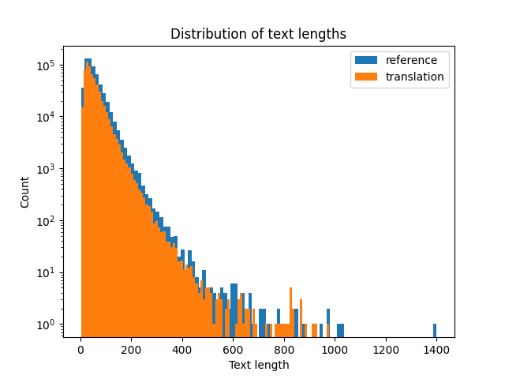
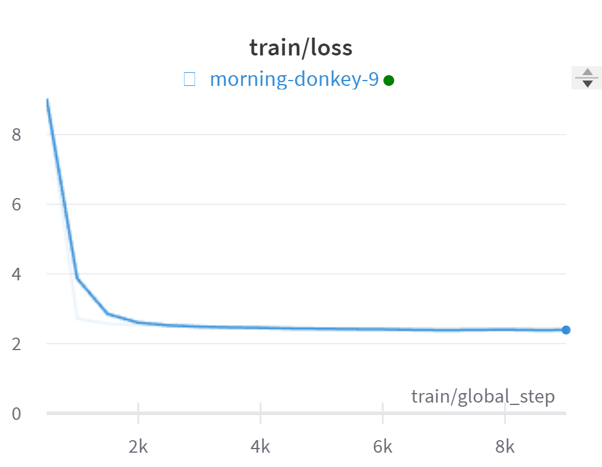
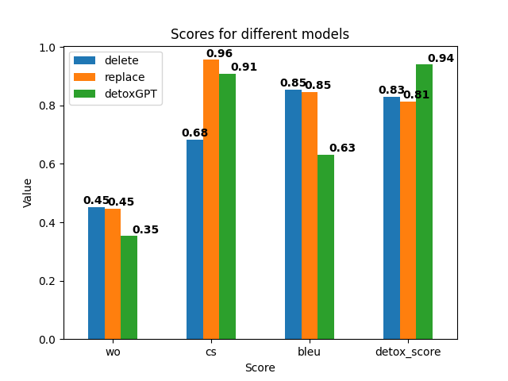

# Final Solution Report

This report is dedicated to describe the final solution for the task of detecting profanity in text (or text detoxification). **Warning:** this report contains profanity.

## Introduction

This report documents the process of developing a machine learning solution for detecting and removing profanity from text. Profanity detection is an important task for many use cases, such as content moderation, filtering AI outputs, cooling down heated discussions, etc. But this task also presents challenges due to the nuanced nature of language.

## Data analysis

We begin by analyzing the dataset to get a better grasp on how to approach the problem. It is the toxic comment parallel corpus of the following structure:

| Column      | Type  | Discription                                                      |
| ----------- | ----- | ---------------------------------------------------------------- |
| reference   | str   | First item from the pair                                         |
| translation | str   | Second item from the pair - paraphrazed version of the reference |
| similarity  | float | cosine similarity of the texts                                   |
| lenght_diff | float | relative length difference between texts                         |
| ref_tox     | float | toxicity level of reference text                                 |
| trn_tox     | float | toxicity level of translation text                               |

It consists of 500k pairs of sentences. For this task, we will focus only on `reference` and `translation` columns for the sake of simplicity.

### Text lengths

We begin with exploratory data analysis to understand the distribution of text lengths. The following figure shows the distribution of text lengths for both `reference` and `translation` columns.



We can see that the distribution of text lengths is very similar for both columns. The distribution is skewed to the left, with the majority of texts having fewer than 50 characters[^1]

[^1]: Word count might be more informative than text length for text data

The mean 50 percentile of the text length is 44 characters, and the 95 percentile is 121 characters. So as the rule of thumb, we will use the length of 96 characters as the maximum length of the text. After removing texts longer than 96 characters, we are left with 85% of the original dataset.

Some pairs of texts have more toxic translations than references. To avoid inconsistencies, we swap the texts in such pairs.

Finally, we save the preprocessed dataset to the `data` folder. For more details, please refer to the [data preprocessing notebook](../notebooks/02__dataset_preprocessing.ipynb).

## Model Specification

For this profanity detection application, we leverage GPT-2's ability to perform text style transfer. We frame profanity detection as a style transfer task, with two styles: toxic (profane) and non-toxic (clean).

We fine-tune GPT-2 on a parallel corpus of toxic and non-toxic sentence pairs. Special tokens indicate the style, allowing GPT-2 to learn transformations from toxic to non-toxic text.

We transform the dataset into a style transfer corpus by prepending the toxic sentences with `[TOX]` and appending the non-toxic sentences with `[/TOX]`. We also prepend the non-toxic sentences with `[DETOX]` and append the toxic sentences with `[/DETOX]`. This way, GPT-2 learns to transfer text from the toxic to the non-toxic style when predicting the next word.

```text
Parallel corpus:
  Toxic:     What the hell do they expect me to say?
  Non-toxic: What did they expect me to say?

Style-transfer corpus:
  [TOX]What the hell do they expect me to say?[/TOX]»»[DETOX]What did they expect me to say?[/DETOX]
```

## Training Process

Training is performed on 35% of the dataset due to limited computational resources. The training process is monitored with [Weights & Biases](https://wandb.ai/). The following figure shows the training loss for the model.



The model is trained for 1 epochs. The training process takes 1 hour on two NVIDIA T4 GPUs.

For more details, see [this notebook](../notebooks/03_1__GPT2_training.ipynb).

## Evaluation

Trained model is not guaranteed to procude profanity-free or even sensible text. We evaluate the model on the test set to get a better understanding of its performance.

### Metrics

For this task, we use two different types of metrics:

- Style Transfer Accuracy
- Similarity

#### Style Transfer Accuracy

Our hypothesis is that the model should be able to transfer the style of the text from toxic to non-toxic. To evaluate the toxicity, we use the logistic regression classifier trained on the [Jigsaw Toxic Comment Classification Challenge](https://www.kaggle.com/c/jigsaw-toxic-comment-classification-challenge) dataset that achieved the highest public score.

For more details, see [this notebook](../notebooks/04_1__metrics_STA.ipynb).

#### Similarity

For measuring the similarity, we use three different metrics:

- Word Overlap: unigram overlap between two texts
- Cosine Similarity
- BLEU Score

The final score is the mean of the style transfer accuracy (STA) and similarity scores. Since we want to reduce the toxicity of the text, the final score is defined as:

$$
(1 - \text{STA}) +
\begin{bmatrix}
   0.1 \\
   0.5 \\
   0.4
\end{bmatrix}^T
\begin{bmatrix}
   \text{Word Overlap} \\
   \text{Cosine Similarity} \\
   \text{BLEU Score}
\end{bmatrix},
$$

where weights are chosen arbitrarily based on the intuition that word overlap tend to be zero for rephrased sentences, and cosine similarity and BLEU score are more informative.

For more details, see [this notebook](../notebooks/04_2__metrics_similarity.ipynb).

# Inference Process

The inference process is straightforward. We feed the model with annotated toxic text and get a sequence of predicted continuation. We then remove the tokens from the sequence and get suggested detoxified texts.

After, we evaluate each suggested text with the metrics described above and choose the best one.

For more details, see [this notebook](../notebooks/03_2__GPT2_inference.ipynb) and [this notebook](../notebooks/05_GPT2_inference_with_metrics.ipynb).

## Results

We evaluated the performance of the fine-tuned GPT-2 model on the test set and compared it to two baselines:

- Delete -- [deleting detected profanity words](../notebooks/00_1__delete_baseline.ipynb).
- Replace -- [replacing profanity words with synonyms](../notebooks/00_2__replace_baseline.ipynb).

The following chart summarizes the similarity scores and detoxification scores for the different models.



## Conclusion

In this assignment, we explored different techniques for profanity detection and text detoxification. We analyzed a dataset of toxic and non-toxic text pairs, specified a transformer-based model architecture using GPT-2, fine-tuned the model, and evaluated its performance against baselines.

Our key findings include:

- The GPT-2 style transfer approach outperforms the basic baselines of deleting or replacing profanity words. This indicates pretrained language models are promising for text detoxification when framed as a style transfer task.

- However, the GPT-2 model still struggles with fully removing toxicity and maintaining semantic similarity to the original text. There is room for improvement in controlling the model's outputs.

- Training on a larger dataset, experimenting with different model variations and prompts, and incorporating similarity metrics into the loss function could potentially enhance performance.

Overall, this project demonstrated the feasibility of using state-of-the-art NLP techniques for automated profanity detection and filtering. With further refinement, a system like this could be valuable for content moderation applications.

The methods and analysis presented provide a strong foundation for future work on making AI communication safer, more inclusive, and constructive.
